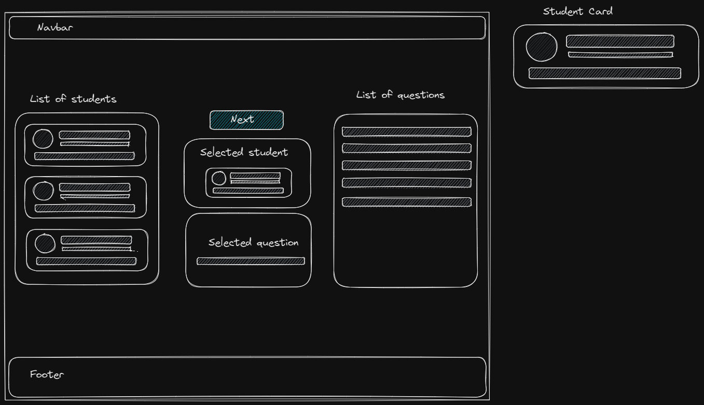

# Ice Breaker App

### To run the app

- Start the backend server with `npm run server`. This will spin up the mocked backend server on port 4000.
- Start the frontend app with `npm start`. This will spin up the frontend app on port 3000.
